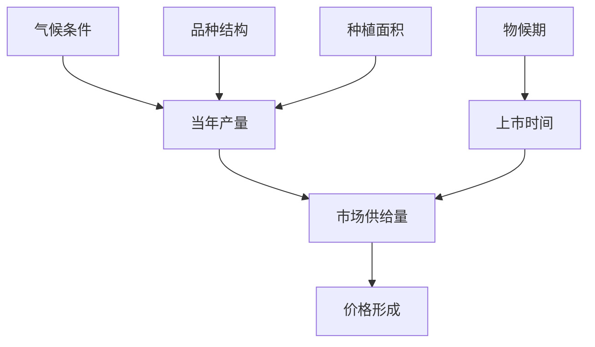

# 荔枝价格形成机制与波动规律

> 荔枝属于典型的季节性鲜果，其价格受供需关系、气候条件、品种结构、物流成本等多重因素影响，呈现出明显的季节性波动和年度波动特征。理解荔枝价格形成机制与波动规律，对种植户、贸易商、政策制定者均具有重要参考价值。

---

## 一、价格形成理论基础

### 荔枝价格影响因素体系

| 因素类别 | 具体因素 | 影响方向 | 作用强度 | 时间尺度 |
|---------|---------|---------|---------|---------|
| **供给因素** | 当年产量、上市时间、质量等级 | 反向 | 强 | 短期 |
| **需求因素** | 消费偏好、节日效应、替代水果价格 | 正向 | 中 | 短期 |
| **成本因素** | 生产成本、物流成本、损耗率 | 正向 | 中 | 长期 |
| **市场结构** | 流通环节、交易方式、信息对称度 | 综合 | 中 | 中长期 |
| **外部冲击** | 极端天气、政策调控、突发事件 | 剧烈 | 强 | 瞬时 |
| **预期因素** | 天气预报、产量预测、市场预期 | 提前反映 | 中 | 短中期 |

### 价格弹性分析

| 供需弹性 | 短期弹性 | 长期弹性 | 说明 |
|---------|---------|---------|------|
| **需求价格弹性** | 0.3-0.5 | 0.6-0.8 | 短期缺乏弹性，长期弹性增大 |
| **供给价格弹性** | 0.1-0.2 | 0.4-0.6 | 短期极低(当年产量已定)，长期较高 |
| **交叉价格弹性** | 0.5-0.8 | 0.6-1.0 | 与龙眼、芒果等替代水果相关 |
| **收入弹性** | 0.8-1.2 | 1.0-1.5 | 随着收入增加，消费量提升 |

---

## 二、季节性价格波动规律

### 年内价格走势

| 时间段 | 价格区间(元/kg,批发价) | 价格水平 | 供应品种 | 主要影响因素 |
|-------|---------------------|---------|---------|------------|
| 4月下旬-5月上旬 | 30-60 | 极高 | 三月红、特早熟 | 早熟尝鲜，供应极少 |
| 5月中旬-5月下旬 | 15-35 | 高 | 白糖罂、妃子笑(早) | 上市量逐渐增加 |
| 6月上旬-6月中旬 | 8-20 | 中等 | 妃子笑(盛)、黑叶 | 上市高峰期，量大价低 |
| 6月下旬-7月上旬 | 12-35 | 中高 | 桂味、糯米糍 | 品质优良品种上市 |
| 7月中旬-7月下旬 | 10-25 | 中低 | 迟熟品种、广西产区 | 产季尾期，品质下降 |
| 8月以后 | 20-40 | 高 | 冷库贮藏果 | 鲜果退市，库存为主 |

### 月度价格指数

| 月份 | 4月 | 5月 | 6月 | 7月 | 8月 | 9月 |
|-----|-----|-----|-----|-----|-----|-----|
| 价格指数(年均=100) | 280-320 | 150-200 | 70-100 | 100-150 | 180-250 | 200-280 |
| 交易量占比(%) | 1-2 | 15-25 | 45-55 | 20-30 | 3-5 | 1-2 |

---

## 三、年度价格波动规律

### 大小年与价格波动

| 年份类型 | 产量变动幅度 | 价格变动幅度 | 种植户收入变动 | 典型年份 |
|---------|------------|------------|-------------|---------|
| **丰产年(大年)** | +20-40% | -30-50% | -10-30% | 2018、2020、2022 |
| **平产年** | -10%至+10% | -15%至+20% | -5%至+15% | 2019、2021 |
| **减产年(小年)** | -20-50% | +40-100% | +10-30% | 2016、2017、2023 |

### 近年价格走势

| 年份 | 平均批发价(元/kg) | 最高价(元/kg) | 最低价(元/kg) | 产量(万吨) | 较上年变动 |
|------|-----------------|-------------|-------------|-----------|----------|
| 2016 | 18.5 | 45.0 | 6.0 | 210 | 减产严重 |
| 2017 | 16.8 | 38.0 | 5.5 | 240 | 恢复性增产 |
| 2018 | 9.5 | 22.0 | 3.0 | 330 | 丰产价跌 |
| 2019 | 12.5 | 28.0 | 4.0 | 280 | 正常年份 |
| 2020 | 8.8 | 20.0 | 2.5 | 320 | 疫情影响 |
| 2021 | 11.0 | 25.0 | 3.5 | 290 | 恢复性 |
| 2022 | 7.5 | 18.0 | 2.0 | 350 | 丰产滞销 |
| 2023 | 15.0 | 42.0 | 5.0 | 250 | 减产涨价 |

---

## 四、不同流通环节价格差异

### 产业链各环节价格与利润分配

| 流通环节 | 价格(元/kg) | 成本(元/kg) | 利润(元/kg) | 利润率(%) | 价格占比(%) |
|---------|-----------|-----------|-----------|----------|-----------|
| **田头价** | 5-20 | 3-5 | 2-15 | 40-75 | 100(基准) |
| **产地批发价** | 7-25 | 1-2(代办费) | 1-3 | 15-20 | 120-140 |
| **销地批发价** | 10-35 | 2-5(物流+包装) | 1-4 | 10-20 | 150-200 |
| **零售价(超市)** | 20-60 | 3-8(损耗+租金) | 5-15 | 25-35 | 300-400 |
| **零售价(水果店)** | 16-50 | 2-5(损耗) | 4-10 | 25-30 | 250-350 |
| **电商零售价** | 25-70 | 8-15(包装+快递) | 3-10 | 12-20 | 400-500 |

### 不同品种价格倍率

| 品种 | 田头价(元/kg) | 销地零售价(元/kg) | 价格倍率 |
|------|-------------|-----------------|---------|
| 妃子笑 | 8-20 | 20-40 | 2.0-3.0 |
| 桂味 | 15-40 | 40-80 | 2.0-3.0 |
| 糯米糍 | 20-60 | 60-120 | 2.5-3.5 |
| 黑叶 | 4-10 | 10-20 | 2.0-2.5 |
| 白糖罂 | 10-25 | 25-50 | 2.0-2.5 |

---

## 五、价格波动成因分析

### 供给端影响因素

| 气候因素 | 对产量的影响 | 对价格的影响 | 典型情形 |
|---------|------------|------------|---------|
| 暖冬+干旱 | 利于成花，产量增加 | 价格下跌 | 2022年广东暖冬 |
| 倒春寒 | 授粉不良，坐果率低 | 价格上涨 | 2023年倒春寒 |
| 花期阴雨 | 授粉受阻，大幅减产 | 价格飙升 | 2016年花期连阴雨 |
| 采前暴雨 | 裂果落果，品质下降 | 结构性上涨 | 2021年6月暴雨 |
| 台风 | 直接落果，严重减产 | 短期暴涨 | 2018年"山竹"台风 |

### 需求端影响因素

| 需求因素 | 影响方向 | 影响程度 | 具体表现 |
|---------|---------|---------|---------|
| 节日消费(端午、中秋) | 拉动需求 | 强 | 节前5-7天价格上升10-25% |
| 高温天气 | 刺激消费 | 中 | 气温升高，鲜果需求增加 |
| 替代水果价格 | 交叉影响 | 中 | 龙眼、芒果、西瓜等价格影响 |
| 居民收入水平 | 正向影响 | 弱-中 | 荔枝消费收入弹性较高 |
| 消费升级趋势 | 品质溢价 | 强 | 优质品种溢价空间大 |

---

## 六、价格预测模型

### 常用预测方法

| 预测方法 | 适用场景 | 预测精度 | 数据要求 | 方法特点 |
|---------|---------|---------|---------|---------|
| **时间序列分析** | 短期价格预测 | 中 | 历史价格数据 | 简单易用，但忽略影响因素 |
| **多元回归模型** | 中长期预测 | 中高 | 多因素数据 | 考虑供需因素，解释性强 |
| **ARIMA模型** | 月度价格预测 | 高 | 长序列数据 | 适合季节性波动分析 |
| **神经网络模型** | 复杂非线性预测 | 高 | 大量多维数据 | 精度高，但可解释性差 |
| **灰色GM(1,1)模型** | 小样本预测 | 中 | 少量数据 | 适合数据不足的情景 |

### 价格预警机制

| 预警等级 | 价格变动幅度 | 预警指标 | 应对措施 |
|---------|------------|---------|---------|
| **红色预警** | 价格下跌>50%或上涨>100% | 田头价<3元/kg 或 >40元/kg | 启动价格保护、临时收储 |
| **橙色预警** | 价格下跌30-50%或上涨50-100% | 田头价3-5元/kg 或 25-40元/kg | 引导错峰销售、加大促销 |
| **黄色预警** | 价格下跌15-30%或上涨20-50% | 田头价5-8元/kg 或 18-25元/kg | 加强信息发布、产销对接 |
| **蓝色预警** | 价格波动<15% | 正常波动区间 | 常规监测，无需干预 |

---

## 七、价格稳定对策建议

### 短期应对措施

| 措施 | 实施主体 | 具体做法 | 预期效果 |
|------|---------|---------|---------|
| 产销对接 | 政府+行业协会 | 组织产地与销区对接会 | 减少中间环节，稳定价格 |
| 信息发布 | 政府平台 | 每日发布产地价格、销地价格 | 减少信息不对称 |
| 电商促销 | 电商平台 | 618、荔枝节等促销活动 | 扩大消费，稳定价格 |
| 金融支持 | 金融机构 | 提供收购资金贷款 | 缓解收购商资金压力 |
| 冷链物流补贴 | 政府 | 对冷链物流给予补贴 | 降低流通成本 |

### 长效机制建设

| 机制 | 建设内容 | 时间周期 | 投入需求 |
|------|---------|---------|---------|
| 价格指数保险 | 建立价格保险产品 | 2-3年 | 保费补贴 |
| 市场预警系统 | 大数据监测预警平台 | 1-2年 | 信息平台建设 |
| 品牌溢价机制 | 区域公用品牌建设 | 3-5年 | 品牌推广投入 |
| 期货期权市场 | 鲜果期货品种研发 | 5-10年 | 交易所主导 |
| 产业基金 | 产业风险调节基金 | 2-3年 | 政府+企业共同出资 |

---

> **参考文献**
> 1. 张玉, 王建平. 中国荔枝市场价格波动特征与影响因素分析. 农业技术经济, 2022(4): 56-68.
> 2. 国家荔枝龙眼产业技术体系. 荔枝市场价格监测年报(2023). 华南农业大学.
> 3. 刘洋, 陈厚彬. 基于ARIMA模型的荔枝价格预测研究. 南方农业学报, 2021, 52(3): 789-796.
> 4. 农业农村部. 全国农产品批发市场价格信息系统年度报告. 2023.
> 5. 林伟, 赵晓峰. 农产品价格波动与农民收入关系研究—以荔枝为例. 农业经济, 2022(9): 34-41.
> 6. 广东省价格监测中心. 广东省荔枝市场价格分析报告. 2023.
> 7. 海南热带农业经济研究中心. 海南荔枝价格波动规律研究. 2022.